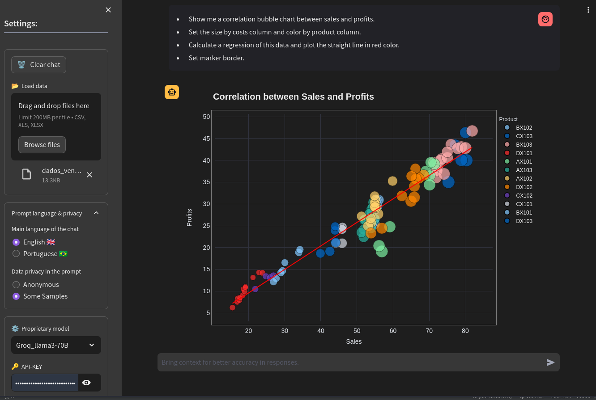

<br/>

# AI-Datanalysis

<br/>

**AI-Datanalysis** là một công cụ chatbot được hỗ trợ bởi tác nhân AI để phân tích và khám phá kiến ​​thức trong dữ liệu.

Dự án này nhằm mục đích tạo điều kiện thuận lợi cho việc giải thích và thao tác dữ liệu, cho phép người dùng đặt câu hỏi bằng ngôn ngữ tự nhiên và nhận thông tin chi tiết trực tiếp từ dữ liệu của họ thông qua biểu đồ, bảng, văn bản hoặc thậm chí cả bản đồ.
Bộ não của ứng dụng chủ yếu dựa trên các mô hình tổng quát (LLM) được tích hợp với các giải pháp khung mạnh mẽ như: **Plotly** (công cụ đồ họa), **Langchain** (giao diện LLM), **Statsmodels** và **Scipy** (thống kê), **Pandas** (khung dữ liệu), **Numpy** (toán học), **Streamlit** (giao diện web), **Scikit-learn** (Học máy), ngoài khả năng bao gồm các mô-đun khác khi thực thi môi trường.

<br/>

<h3 align="center">
  
</h3><br/>

## Prerequisites

- [Docker](https://docs.docker.com/get-docker/)
- [Docker Compose](https://docs.docker.com/compose/install/)
- [Git](https://git-scm.com/book/en/v2/Getting-Started-Installing-Git)
- [Poetry](https://python-poetry.org/)
- [Python &gt;= 3.11](https://www.python.org/downloads/)
- Ambiente Linux | Windows

<br/>

## Get started

### Web app access

- Access the web application here  [https://ai-datanalysis.streamlit.app/](https://ai-datanalysis.streamlit.app/)

### Local installation

#### Option-1 Docker (recommended):


#### Option-2 Poetry:

poetry shell
poetry install

streamlit run app.py 
```

<br/>

## Usage

- Sau khi cài đặt, truy cập ứng dụng trong trình duyệt bằng cách sử dụng [http://0.0.0.0:8501](http://0.0.0.0:8501) or [http://localhost:8501](http://localhost:8501)

## Experiments reproducibility

- Datasets and prompts available in the **datasets** directory


| Datasets            | 
| ------------------- | 
| cancer_data.csv     |
| everest_data.csv    | 
| sales_data.csv      |
| digits.csv          |
| iris.csv            |
| ohlcv.csv           |
| geojson_brasil.json |

<br />

## License

[MIT](https://choosealicense.com/licenses/mit/)

<br/>
